<div align="center">
  

  <h3>Your Filesystem's Best Friend</h3>
  <p><i>Mount a folder from a remote server and use it like it's local — over the public internet, no VPN.</i></p>

  [](https://github.com/gMountie/gMountie/releases)
  [](go.mod)
  
  
  
  [](https://docs.gmountie.dev)
  [](https://opensource.org/licenses/Apache-2.0)
</div>

---

**gMountie makes a remote directory behave like a local folder — built for the internet, not the LAN.** A `gmountie serve` process exposes folders as named **volumes**; a `gmountie mount` client mounts one over [FUSE](https://www.kernel.org/doc/html/latest/filesystems/fuse.html) and proxies every filesystem call to the server over [gRPC](https://grpc.io). No VPN, no sync, no copying everything to disk first.

<div align="center">
  
</div>

<details>
<summary><b>Contents</b></summary>

- [Why gMountie](#why-gmountie)
- [How it fits](#how-it-fits)
- [Quick start](#quick-start)
- [How it works](#how-it-works)
- [Features](#features)
- [Documentation](#documentation)
- [Contributing](#contributing)
- [License](#license)

</details>

## <a id="why-gmountie"></a>Why gMountie? 🤔

Accessing files on a server across the internet usually means a VPN plus NFS/SMB (brittle once real latency shows up), or a sync tool that copies everything first. gMountie goes for the NFS *feel* — a real, live mounted filesystem — but designed for the internet from day one:

- **🚫 No VPN.** It's just a TLS gRPC connection. Expose the port or put it behind a reverse proxy, and mount from anywhere.
- **🔌 It survives the network.** Sessions and idempotent RPCs mean a dropped connection, an ISP IP change, or a server restart won't kill your mount or your open files — they reconnect and resume.
- **⚡ Reads get cheap after the first one.** A persistent client cache — in memory *and* on disk, kept fresh by server push — means re-reading a file doesn't cross the wire again.
- **📦 One small binary.** The same `gMountie` is both the server and the client.

> [!NOTE]
> gMountie is **alpha**. The **server is Linux-only**; the **client mounts on Linux and macOS**. Transport is TLS (auto-generated cert on first run) with basic-auth or mTLS and per-user volume ACLs — a great fit for mounting your own servers over the public internet. OIDC/JWT auth is on the [roadmap](docs/roadmap.md).

## <a id="how-it-fits"></a>How it fits 🧭


Where gMountie sits next to the usual ways of mounting remote storage:

| | **gMountie** | NFS over VPN | sshfs | rclone / s3fs |
|---|:---:|:---:|:---:|:---:|
| **Setup** | one binary, two commands | VPN + NFS server + auth | sshd + sshfs | bucket + creds + tool |
| **Works without a VPN** | ✅ TLS gRPC port | ❌ needs the tunnel | ✅ over SSH | ✅ |
| **Survives network blips** | ✅ sessions + idempotent retries | ⚠️ mount stalls / hard-locks | ❌ SSH drops | ❌ per-request |
| **Client cache** | ✅ memory + disk, push-invalidated | ❌ | ❌ | ⚠️ varies |
| **WAN read throughput** | ✅ streaming + readahead | ❌ RTT-amplified metadata | ❌ slow on high RTT | ⚠️ per-object HTTP |
| **POSIX correctness** | ✅ atomic rename, mtime, mmap | ✅ (NFSv4) | ⚠️ partial | ❌ eventual |

<sub>Full matrix, including Tailscale Drive, and "when each makes sense" → **[docs: comparison](docs/comparison.md)**.</sub>

## <a id="quick-start"></a>Quick start 🚀


> The **server** (Linux only) just exposes folders. The **client** mounts via FUSE: install `fuse3` (`/dev/fuse`) on Linux, or [**macFUSE**](https://macfuse.io) / [**FUSE-T**](https://www.fuse-t.org/) on macOS.

### 1. Get `gMountie`

```bash
# Build from source (Go 1.2x) — gives you both the server and the client
git clone https://github.com/gMountie/gMountie && cd gMountie
go build -o gmountie ./cmd
```

<details>
<summary>Prefer not to build?</summary>

Grab a `gMountie_linux_*.tar.gz` (or `gMountie_darwin_*.tar.gz` for the macOS client) from the [releases page](https://github.com/gMountie/gMountie/releases), or run the server from the container image `ghcr.io/gmountie/gmountie-server`.

</details>

### 2. Start a server

Zero-config: run `gmountie serve` with no arguments. On first start it writes `~/.config/gmountie/server.yaml` (binding `0.0.0.0:9449`), creates a `shared` volume, and prints a **random admin password once** — copy it.

<details>
<summary>Or write your own <code>server.yaml</code></summary>

```yaml
server:
  address: 0.0.0.0
  port: 9449
auth:
  type: basic
  users:
    - username: admin
      password_hash: $argon2id$v=19$m=19456,t=2,p=1$...   # output of: gmountie genpass
volumes:
  - name: shared
    path: /srv/shared        # the folder to expose
```

```bash
gmountie serve -c server.yaml
```

`password_hash` must be a `$argon2id$` PHC string — the server rejects plaintext at startup. Generate one with `gmountie genpass`.

</details>

### 3. Mount it from a client

```bash
mkdir -p ~/mnt/shared
gmountie mount admin@your-server.example:9449/shared ~/mnt/shared
# Password: (the one printed on first server run)

# ...and use it like any other folder:
ls ~/mnt/shared
```

The password resolves from `--password`, then the config file, then `$GMOUNTIE_AUTH_PASSWORD`, then an interactive no-echo prompt.

<details>
<summary>List volumes first, mount in the background, or use the flag form</summary>

```bash
# See what the server exposes before mounting:
gmountie ls admin@your-server.example:9449

# Mount in the background (detach once ready):
gmountie mount admin@your-server.example:9449/shared ~/mnt/shared --daemon

# The classic flag form still works:
gmountie mount ~/mnt/shared -s your-server.example:9449 -n shared -u admin
```

</details>

For TLS pinning (TOFU), reverse proxies, and the full `client.yaml` reference, see **[docs.gmountie.dev](https://docs.gmountie.dev)**.

## <a id="how-it-works"></a>How it works 🏗️

```
     your machine                                   remote server
┌─────────────────────┐       gRPC over HTTP/2     ┌─────────────────────┐
│   gmountie mount    │ ◀────────────────────────▶ │   gmountie serve    │
│  FUSE mount point   │  metadata · data · events  │  real folders       │
│  + local cache      │      (TLS, Snappy)         │  exposed as volumes │
└─────────────────────┘                            └─────────────────────┘
```

The client implements a FUSE filesystem and turns each syscall into a gRPC call against the server, which serves it from the volume's real directory. Metadata, file data, and cache-invalidation events travel over separate gRPC services, so they can be tuned independently.

Dig deeper: **[Architecture & Protocol](docs/design/architecture.md)** · **[Caching & Consistency](docs/design/caching-and-consistency.md)** · **[Performance](docs/design/performance.md)**

## <a id="features"></a>Features ✨

<details open>
<summary><b>Fast</b></summary>

- gRPC **streaming** Read/Write with a tunable frame size — no message-size ceiling on large files
- A **persistent client cache** for attributes, directory listings, and file data — in memory *and* on disk, kept coherent by server push
- **Readahead** and **write coalescing** for sequential I/O, **compound** metadata batching to cut round-trips, plus an optional **writeback** mode and **Snappy** compression for high-latency links

</details>

<details>
<summary><b>Resilient</b></summary>

- **Sessions + idempotent RPCs**: retries and reconnects are safe and invisible; file handles opened before a blip stay valid after it (within the session grace period)
- **Push-based invalidation** (a server `Subscribe` stream) keeps clients coherent — close-to-open consistency across multiple clients

</details>

<details>
<summary><b>Secure &amp; observable</b></summary>

- Native **TLS** with an auto-generated cert + **TOFU** pinning, or **mTLS**; argon2id-hashed credentials; per-user volume ACLs
- **Prometheus** metrics, health/readiness endpoints, and structured logs
- One binary: `gmountie serve`, `gmountie mount`, `gmountie ls`, `gmountie config show`, `gmountie genpass`, and more

</details>

## <a id="documentation"></a>Documentation 📚

Full docs live at **[docs.gmountie.dev](https://docs.gmountie.dev)**. Highlights:

- [Quick Start](docs/quickstart.mdx) · [Compared to NFS / sshfs / rclone](docs/comparison.md)
- [Architecture & Protocol](docs/design/architecture.md) · [Caching & Consistency](docs/design/caching-and-consistency.md) · [Performance](docs/design/performance.md)
- Configuration & CLI — [server](docs/server/config.md) · [client](docs/client/config.md) · [Roadmap](docs/roadmap.md)

## <a id="contributing"></a>Contributing 🤝

Contributions of every kind are welcome — 🐛 bug reports, 💡 feature ideas, 📝 docs, and 🔧 code. See **[CONTRIBUTING.md](CONTRIBUTING.md)** to get set up, and **[SECURITY.md](SECURITY.md)** to report a vulnerability privately.

<details>
<summary>Naming &amp; branding 📛</summary>

The project name is written **`gMountie`** — lowercase `g`, capital `M`. The `g` is for **gRPC**, the wire protocol the client and server speak.

| Form | Use for |
| --- | --- |
| `gMountie` | Prose, docs, marketing, README, CLI help strings |
| `gmountie` | Go module path, binary name, package names, file/repo names, URLs |
| `GMOUNTIE_` | Environment variable prefix |

Please avoid `GMountie`, `Gmountie`, or other variants when contributing.

</details>

## <a id="license"></a>License 📜

gMountie is open source under the [Apache License 2.0](LICENSE).

---

<div align="center">
  
  <p><i>Happy mounting! 🎉</i></p>

  <sub>📫 <a href="https://github.com/gMountie/gMountie/issues">Issues</a> · ⭐ <a href="https://github.com/gMountie/gMountie">Star us</a> · 💖 <a href="https://github.com/sponsors/johnbuluba">Sponsor</a></sub>
</div>
