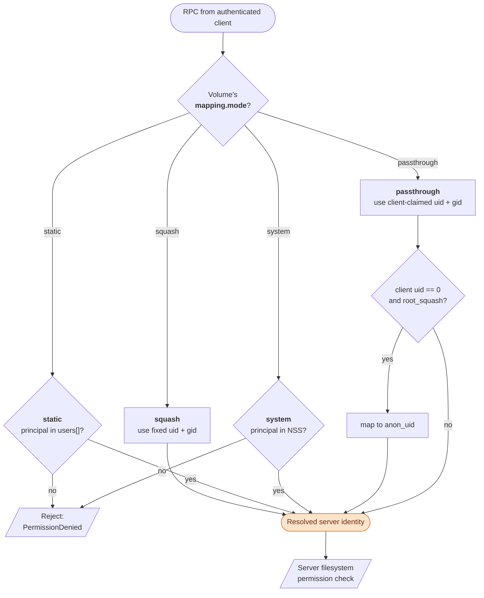

# Identity & ownership

**Authentication says *who* you are. Mapping says *what that means on the server*.** Each volume picks one of four mapping modes; the mode decides which uid/gid the server uses when it touches a file on your behalf, and what your client renders at `ls -l` time.

## The four modes

Configured per volume in `server.yaml` under `volumes[…].mapping`. **Default is `squash`** if you omit the block.

| Mode          | What the server does                                                                                  | Typical use                                                |
| ------------- | ----------------------------------------------------------------------------------------------------- | ---------------------------------------------------------- |
| **squash**    | Every authenticated principal becomes one fixed `(uid, gid)`. Anonymous-style, NFS `all_squash`.       | A read-only or one-owner share. Safest default.            |
| **static**    | Lookup table of `username → {uid, gid, groups[]}` and `groupname → gid`.                              | Small known team; no system users on the server.            |
| **system**    | Resolve the principal against the server's `/etc/passwd` / `/etc/group` (libnss).                     | The server already has real user accounts you want to use. |
| **passthrough** | Use the raw uid/gid the client claims. `root_squash` (default `true`) maps root to `anon_uid`.       | Backups, NAS-style boxes, admin tooling on trusted clients. |

Pick the mode that matches your trust model. Going outside this list isn't a thing — the validator rejects anything else.



## squash

The simplest. One uid + one gid for everyone.

```yaml title="server.yaml"
volumes:
  - name: shared
    path: /srv/shared
    mapping:
      mode: squash
      uid: 1000          # what the server acts as when handling this volume's RPCs
      gid: 1000
```

Every read, write, `stat`, and create on `/srv/shared` runs as `uid=1000, gid=1000`. Permission checks on the server's filesystem use that identity. The client sees files owned by **1000:1000** unless you pass `--raw-ids`.

If `uid` and `gid` are unset, they default to `0` (root). Pick something else unless you mean it.

## static

A small declared table mapping usernames to identities, plus a side table of groupname → gid for shared groups.

```yaml title="server.yaml"
volumes:
  - name: shared
    path: /srv/shared
    mapping:
      mode: static
      users:
        alice:
          uid: 1001
          gid: 1001
          groups: [editors]
        bob:
          uid: 1002
          gid: 1002
          groups: [editors, ops]
      groups:
        editors: 2000
        ops:     2001
```

Useful when the server isn't a multi-user box and you don't want to spin up real system users just to enforce ownership. An authenticated principal not in `users:` is rejected.

## system

Resolve the authenticated username against the server's actual user database (NSS — `/etc/passwd`, `/etc/group`, LDAP/SSSD if configured).

```yaml title="server.yaml"
volumes:
  - name: shared
    path: /srv/shared
    mapping:
      mode: system
```

No knobs — the lookup is "is `<auth username>` a real account on this server?". If yes, the server runs ops as that user (with their primary gid and full supplementary group list); if no, the request is rejected.

This is what you want when the server is already an admin'd machine with real accounts.

## passthrough

The most permissive: trust the uid/gid the client claims and run ops as that identity.

```yaml title="server.yaml"
volumes:
  - name: backup
    path: /srv/backup
    mapping:
      mode: passthrough
      root_squash: true      # default — uid 0 from the client gets remapped
      anon_uid: 65534        # what root-squashed requests become
```

Use this when the client is trusted (your own machine, a backup runner) and you need server-side ownership to follow the client's idea of ownership. `root_squash` (NFS-style) keeps client-root from being able to write as server-root by default.

## Admin capabilities

Two POSIX-style capabilities let service accounts bypass per-file DAC checks on a volume without becoming server-root. Granted per-principal in `static` mode (`caps:`) or per-server-group in `system` mode (`admin_groups:`).

| Capability         | What it bypasses                                                                                      |
|--------------------|--------------------------------------------------------------------------------------------------------|
| `dac_read_search`  | Read and traverse any path on the volume regardless of mode bits. Writes are still denied.            |
| `dac_override`     | Read, traverse, and modify. New entries created during the op are `fchown`ed to the principal so admin writes don't leave root-owned files. |

Enforcement is kernel-native via per-thread `capset`: only the OS thread handling that one request bypasses DAC, leaving every other in-flight request running as its normal identity. The server must run as root for caps to engage; without root, caps are silently ignored and every principal runs unprivileged.

Use cases:

- **`dac_read_search`** is the right cap for backup runners and read-only audit accounts: full visibility, no write surface.
- **`dac_override`** is the break-glass write cap: migration tooling, mass-`chown` scripts, anything that legitimately needs to touch everyone's files. Created entries land owned by the admin principal (not root), so subsequent `ls -l` correctly shows the admin as the originator.

Configuration lives in **[Server reference → Identity mapping](../server/config.md#admin-capabilities-dac_read_search-dac_override)**.

## The client side — WhoAmI and `--raw-ids`

On mount, the client calls a `WhoAmI` RPC against the server. The server replies with **"as I see you on this volume, you are uid X, gid Y, groups [...]"** — the result of running the chosen mapping mode against your authenticated identity.

The client uses that reply to **rewrite file metadata** at `ls -l` time: files the server reports as `(uid X, gid Y)` get rendered as your **local** invoking user — so the listing reads naturally on the client.

Pass `--raw-ids` on the client to disable that rewriting:

```bash
gmountie mount /mnt/shared \
  --server example.com:9449 \
  --auth-type basic -u admin -p '<password>' \
  --volume shared \
  --raw-ids
```

With `--raw-ids` you see exactly the uid/gid the server reports — useful for backups (you want to preserve real ownership), for debugging ("why does this file say `nobody`?"), or for admin tooling that needs the server-side truth.

## What `ls -l` shows in each mode

For an authenticated user `alice` (local uid `1500`) on the client, mounting volume `shared`:

| Server mapping mode      | Server acts as          | Client `ls -l` (default)                    | Client `ls -l` (`--raw-ids`)         |
| ------------------------ | ----------------------- | ------------------------------------------- | ------------------------------------ |
| `squash uid:1000`        | uid=1000                | `alice` (local rewrite)                     | `1000` literally                     |
| `static alice → 1001`    | uid=1001                | `alice`                                     | `1001`                               |
| `system` (alice exists)  | uid=alice on the server | `alice`                                     | server's uid for alice               |
| `passthrough`            | uid=1500 (client claim) | `alice`                                     | `1500`                               |

In all default cases, `alice` sees the listing as if she owned everything she's allowed to see. With `--raw-ids`, she sees the server's reality.

## Permission denials

Permission checks happen **on the server's filesystem**, against the resolved identity. The local view (`ls -l` showing your username) doesn't mean you can write — the server's actual file mode and ownership do.

If `ls -l` shows your name but `touch` returns `EACCES`, the mapped identity doesn't have write permission on the underlying file. Check the file on the server, or pass `--raw-ids` to see who the server actually thinks you are.

## Go deeper

- [Server configuration — Volumes](../server/config.md) — the `mapping` block syntax in context.
- [Client CLI — `--raw-ids`](../client/cli.md) — the flag that turns off the rewriting.
- [Troubleshooting — Permission and ownership](../troubleshooting.mdx) — symptom-driven fixes.
- [Design — Identity & Permissions](../design/identity-and-permissions.md) — the full model, threat assumptions, and protocol details.
