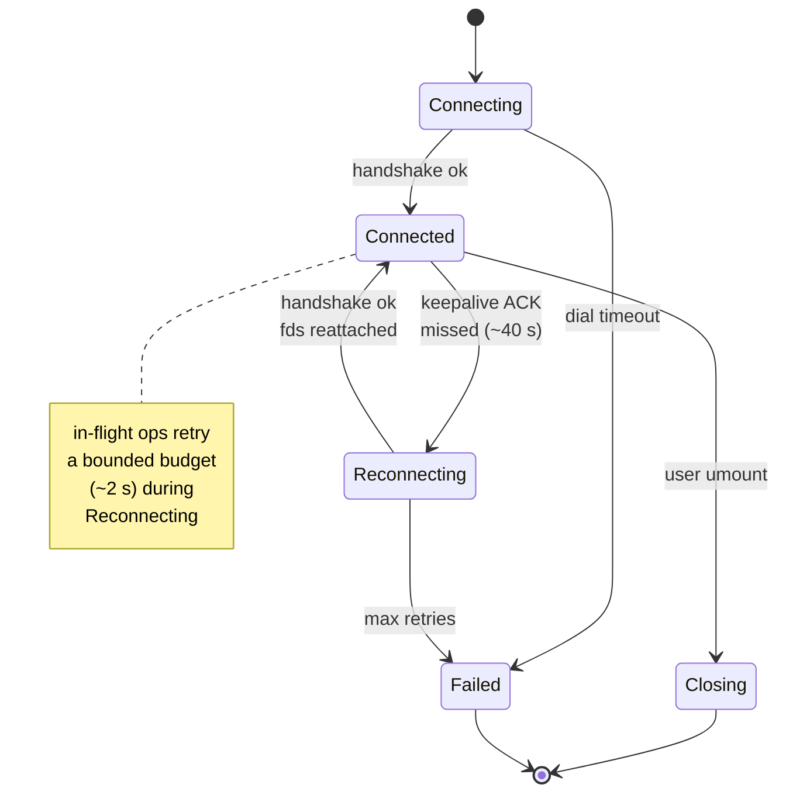

# Sessions & reconnect

**The internet drops packets, NATs rebind, and ISPs reassign IPs. gMountie is built to ride that out: data-path operations retry transient gRPC failures on a bounded budget, the keepalive/session stream reconnects in the background, and open file handles survive a short outage.** Three mechanisms cooperate to make that work.

## 1 · Keepalive — detecting a dead path quickly

gRPC HTTP/2 keepalive pings run in **both directions**:

- The **client** pings the server every `rpc.keepalive.time` (default 30 s) and waits up to `rpc.keepalive.timeout` (default 10 s) for an ACK.
- The **server** does the symmetric thing on its side using `server.keepalive.time` / `timeout`.

If the ACK doesn't come back, the connection is torn down and the next RPC observes `Unavailable`. Default ~40 s end-to-end (30 s interval + 10 s timeout). That's much faster than the kernel's default TCP timeouts (minutes), so a dead path surfaces while the user is still at their terminal.

```yaml
# client
rpc:
  keepalive:
    time: 15s        # tighter detection
    timeout: 5s
    permit_without_stream: true

# server
server:
  keepalive:
    time: 15s
    timeout: 5s
    min_time: 5s
```

`min_time` on the server is a defence against pathologically chatty clients — it's the floor on how fast a client may ping. Match it to your `time` on the client.

## 2 · Bounded retries — safe to retry

The client's retry layer (`avast/retry-go`) wraps data-path RPCs with bounded exponential backoff: up to **3 attempts** with a delay capped at **1 s** (roughly a 2 s total budget). On a transient `Unavailable` / `DeadlineExceeded` it retries quietly; on a logical error (`NotFound`, `PermissionDenied`, `InvalidArgument`) it surfaces immediately. If the retry budget is exhausted before the path recovers, the in-flight syscall returns `fuse.EIO` to the caller.

Two classes of RPC get retried:

- **`Read(volume, fd, offset, length)`** — a pure function of its inputs, so a retry is a direct no-op on success.
- **`Lookup`, `Getattr`, `Readdir`** — observation-only; retried directly.

**`Write` and other mutations** are not pure functions of their inputs, so they aren't retried blindly. Each carries a `request_id`, and the server keeps a per-session idempotency cache (`DoOnce`) keyed by that id: a retried write that already landed is deduplicated server-side rather than applied twice. Operations whose retry semantics can't be made safe this way (e.g. `Mkdir` after the directory already exists, `Unlink` after the file was concurrently deleted) surface the underlying error and let the caller decide.

## 3 · Stable file handles — opens survive a short outage

When the client opens a file, the server allocates an fd in a per-session store. The keepalive/session stream reconnects in the background, and the server holds onto a disconnected session's fds for a **grace period** (`GracePeriod`, default **30 s**) before reaping them:

- If the client reconnects **within** the grace period, it resumes the existing session and its fds stay valid; reads/writes continue from where they were.
- If the outage **exceeds** the grace period, the server releases the fds. The client then starts a fresh session with a new `Create` and logs that any previously open fds are now invalid.

So an open file handle survives a brief drop, but only up to the 30 s grace window — not indefinitely, and not necessarily for the full keepalive detection window. A data-path op in flight during the drop is still bounded by the ~2 s retry budget from §2: if the path doesn't recover in time, that syscall returns `EIO` even though the session may later resume.

## The connection state machine



While **Reconnecting**, the session stream re-establishes in the background and fds stay valid for up to the grace period. In-flight data-path ops retry on a ~2 s budget; if they don't recover in time they return `EIO` even before the state machine lands in **Failed**.

## What the user sees

| Situation                                       | Outward symptom                                                                      |
| ----------------------------------------------- | ------------------------------------------------------------------------------------ |
| Sub-second blip within the retry budget         | In-flight op retries and succeeds. No error visible.                                  |
| ~5 s blip (NAT rebind, brief Wi-Fi drop)        | In-flight ops exceed the ~2 s retry budget and return `EIO`; the session reconnects in the background and fresh ops succeed. Open fds stay valid (within the 30 s grace period). |
| Server reboot, recovery within 30 s grace       | Ops in flight during the drop may return `EIO`; the session resumes with fds intact once the server is back. |
| Outage longer than the 30 s grace period        | Server releases the fds. Client starts a fresh session — previously open fds are invalid. New attempts retry; server back → recovery. |
| Server permanently gone (intentional shutdown)  | `EIO` until you `umount` and re-mount somewhere else.                                |

:::tip[Tuning for your network]
The defaults target consumer-internet flakiness (~40 s detection). If your link is reliable LAN, leave them alone. If it's satellite or cellular with bursts of loss, **raise** `timeout` so you don't tear down a connection that would have recovered. If you need fail-fast for an automation pipeline, **lower** `time` and `timeout`.
:::

## What it isn't

- **Not a VPN.** There's no tunnel layer; reconnection re-establishes the same gRPC connection, not a session over a different transport.
- **Not multi-server failover.** A mount targets one server. If that server is gone, you re-mount elsewhere — there's no built-in failover yet.
- **Not write-replay.** A coalesced write that hit the server **and** got an ACK is durable; a coalesced write that the client dropped on the floor during a disconnect is lost. Applications that need durability call `Flush` or `Fsync` — see [Client config — Write Coalescing](../client/config.md#write-coalescing).

## Go deeper

- [Design — Architecture](../design/architecture.md) — session-state model, the exact retry budget, error-mapping table.
- [Wire protocol](./wire-protocol.mdx) — where keepalive lives in the stack.
- [Cache & consistency](./cache.mdx) — how the cache handles a missed invalidation across a disconnect.
