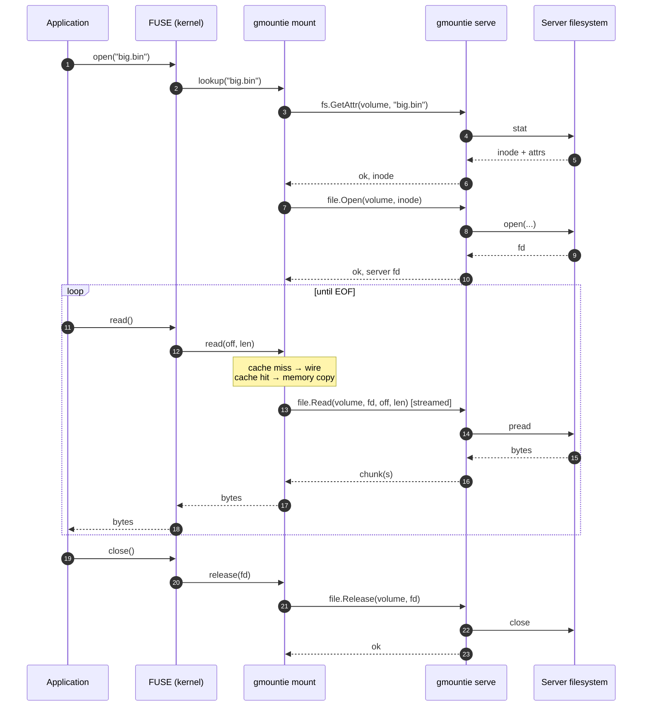

# The wire protocol

**Each FUSE syscall on the client becomes one (or a small number of) gRPC calls to the server, framed in HTTP/2, snappy-compressed by default.** Five services split the work; every request carries the volume name so the server picks the right backing directory.

## The five services

The protocol lives under `api/proto/`. Five application-level gRPC services share one TCP connection (HTTP/2 multiplexes them):

| Service     | What it carries                                              | Examples                                         |
| ----------- | ------------------------------------------------------------ | ------------------------------------------------ |
| **fs**      | Metadata — directory and inode-level ops, plus push invalidations. | `GetAttr`, `OpenDir`, `Mkdir`, `Rename`, `Unlink`, `Subscribe` (push invalidations) |
| **file**    | File data — streaming reads and writes.                      | `Open`, `Read`, `Write`, `Release`, `Flush`      |
| **volume**  | Discovery — what volumes does this server expose?            | `List`, `Resolve`                                |
| **session** | Connection-level session lifecycle and liveness.            | `Create`, `Resume`, `Keepalive`                  |
| **version** | Protocol version negotiation.                                | `Get` (negotiates `frame_size_bytes`)            |

Splitting them lets each be tuned and routed independently — for example, a deep readahead `Read` stream on `file` doesn't head-of-line block a `GetAttr` on `fs`.

## Volume-scoped requests

Every request carries a `volume` field. There's no server-wide session that remembers which volume you're on — each call says it. This keeps a server stateless across volumes and lets a single client multiplex multiple mounts over one connection.

A request that names an unknown volume gets `NotFound` from the server; an unauthorized one gets `PermissionDenied`.

## Transport

- **gRPC over HTTP/2** — one TCP connection per client, all streams multiplexed.
- **Snappy compression** — applied as a custom codec on both sides. Cheap on CPU, helpful on text-heavy payloads (readdir entries, attribute blocks). See `pkg/server/grpc/snappy`.
- **Streaming reads and writes** — `Read` and `Write` are server-streaming and client-streaming respectively, so a single RPC frames many in-flight chunks without per-chunk round-trips. The frame size is server-configurable.
- **Keepalive** — gRPC HTTP/2 pings flow in both directions to detect dead connections within ~40 s by default. See [Sessions & reconnect](./sessions-and-reconnect.mdx).

## Authentication

Two modes ship, selected by `auth.type`: **basic** (username/password validated by a server-side interceptor) and **mtls** (client-certificate identity). There is no anonymous mode.

TLS at the transport layer ships too: the server auto-generates a certificate, and the client picks a verification mode — `verify` (full chain check, the default), `tofu` (trust-on-first-use), or `insecure` (skip verification).

## Idempotency and retries

Where the protocol can, RPCs are designed to be **idempotent**: the same `Read(volume, fd, offset, length)` returns the same bytes; `Write` carries the offset rather than relying on an implicit cursor. The client retries transient failures (`Unavailable`, `DeadlineExceeded`) on operations whose retry is safe — see the implementation in `pkg/client/io` (uses `avast/retry-go`).

Operations with side effects whose retry is *not* obviously safe (`Mkdir` on an existing dir, `Unlink` of a file that may have been deleted concurrently) aren't blindly retried; the client surfaces the underlying error and lets the caller decide.

## What a `cat` looks like on the wire

A `cat /mnt/shared/big.bin` from a cold cache. With the [cache](./cache.mdx) on, repeat reads of the same chunks skip everything between GetAttr/Open and Release.

The diagram glosses one thing: under sequential reads the client opens additional `file.Read` streams as **prefetches** — see [Cache → Sequential reads](./cache.mdx) for the readahead model.

## Go deeper

The wire-format detail, RPC catalogue, and protocol-evolution rules live in the design doc:

- [Architecture & Protocol](../design/architecture.md) — every RPC, the framing, the error-mapping, and the protocol's stability guarantees.
- [Caching & consistency](../design/caching-and-consistency.md) — how the `Subscribe` stream feeds the client cache.
