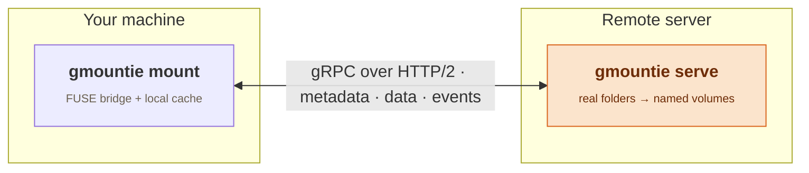

# gMountie

**Mount a directory from a remote server and use it like a local folder — over the public internet, no VPN, and without falling apart when the network hiccups.** gMountie is built on [FUSE](https://www.kernel.org/doc/html/latest/filesystems/fuse.html) and [gRPC](https://grpc.io): a `gmountie serve` process exposes folders as named **volumes**, and a `gmountie mount` client mounts one locally and proxies every filesystem call to the server.

> **Alpha.** Server is Linux-only; the client mounts on Linux and macOS. gMountie is a great fit for mounting your own servers; it is not yet meant to face hostile networks. See the [roadmap](./roadmap.md) for TLS and security hardening.

## Start here

- **[Quickstart](./quickstart.mdx)** — serve a folder and mount it in two commands.
- **Server reference** — [CLI](./server/cli.md) · [Configuration](./server/config.md)
- **Client reference** — [CLI](./client/cli.md) · [Configuration](./client/config.md)

## How it works

The client implements a FUSE filesystem and turns each syscall into a gRPC call against the server, which serves it from the configured volume's real directory. Metadata, file data, and cache-invalidation events travel over three separate gRPC services, so they can be routed and tuned independently.

## Design deep-dives

- [Architecture & Protocol](./design/architecture.md)
- [Caching & Consistency](./design/caching-and-consistency.md)
- [Performance](./design/performance.md)
- [Identity & Permissions](./design/identity-and-permissions.md)
- [Operations & Packaging](./design/operations-and-packaging.md)
